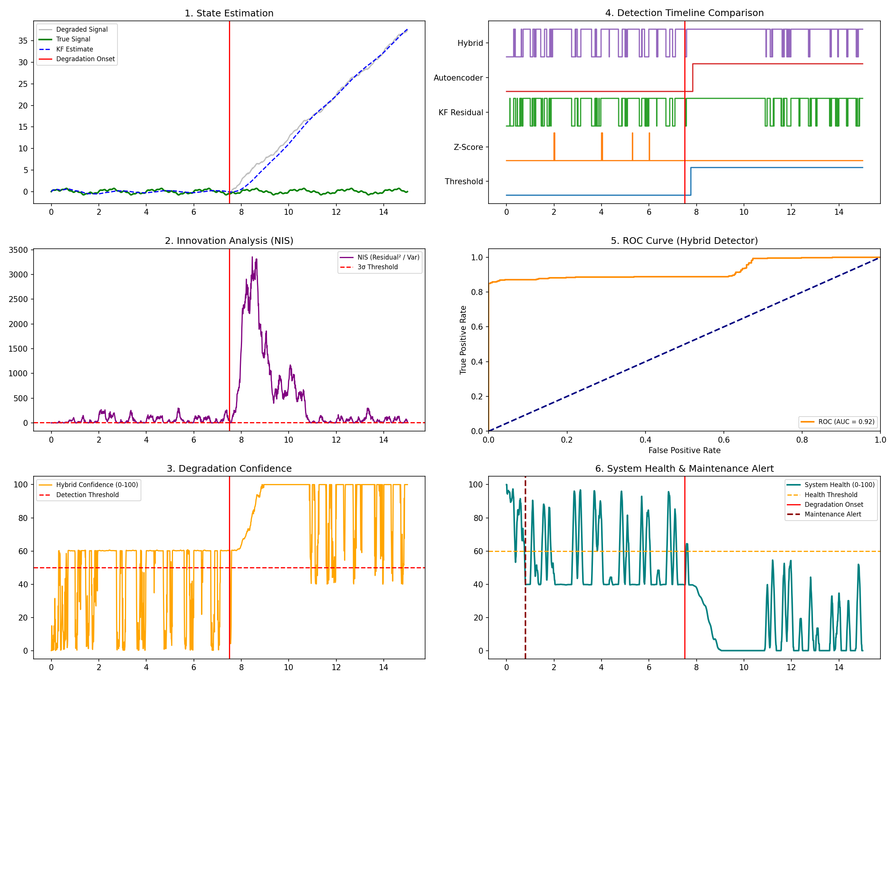

# Equipment Health Monitoring and Predictive Maintenance Framework

[](https://www.python.org/downloads/)
[](https://opensource.org/licenses/MIT)

A modular Python framework for simulating equipment degradation, comparing multiple detection strategies, and generating actionable maintenance recommendations based on real-time health scoring.

## Problem Statement

Equipment in production environments degrades gradually — bearings wear, calibration drifts, sensors lose precision. Detecting these changes early enough to schedule preventive maintenance (before failure) reduces unplanned downtime and repair costs.

This framework provides a controlled simulation environment to:
- Model realistic degradation patterns on time-series signals.
- Compare detection strategies ranging from simple thresholds to hybrid model-based + ML approaches.
- Quantify detection latency, false alarm rates, and early-warning lead time.
- Generate an Equipment Health Index (0-100) with automated maintenance alerting.

## Architecture

```
data_generation.py      Synthetic signal generation with configurable noise
fault_injection.py      Parameterized degradation scenarios (drift, spike, dropout, etc.)
state_estimation.py     Kalman filter state tracking via filterpy
detectors.py            Detection strategies (Threshold, Z-Score, NIS, Autoencoder)
hybrid_logic.py         Fusion of model-based and ML anomaly signals
health_monitor.py       Equipment Health Index and maintenance alert logic
evaluation.py           Performance metrics (F1, FPR, latency, lead time, ROC)
experiments.py          Batch parameter sweeps (noise x severity)
main_demo.py            End-to-end visual demonstration
visualization.py        Multi-panel diagnostic dashboard generation
test_core.py            Smoke tests for core pipeline components
```

## Detection Strategies

| Detector | Approach | Strength | Limitation |
|:---|:---|:---|:---|
| Threshold | Absolute bounds on raw signal | Zero latency for large deviations | Misses gradual drift within bounds |
| Z-Score | Rolling statistical deviation | Adaptive to local statistics | Normalizes slow drift over time |
| Kalman NIS | Normalized Innovation Squared | Catches kinematic inconsistencies | Sensitive to Q/R tuning |
| Autoencoder | Reconstruction error on sliding windows | Detects contextual pattern shifts | Higher compute cost, needs training data |
| Hybrid | Weighted fusion of NIS + Autoencoder scores | Best balance of sensitivity and specificity | Requires threshold calibration |

## Equipment Health Index

The `HealthMonitor` converts the hybrid anomaly confidence into an operational health score:

```
Health = 100 - smoothed_anomaly_confidence
```

When health drops below a configurable threshold for N consecutive intervals, a maintenance recommendation is issued. This provides a simple, interpretable signal for operations teams.

## Degradation Models

| Scenario | Description |
|:---|:---|
| Bias Drift | Gradual linear offset increase over time |
| Spike | Sudden extreme deviation in one or few samples |
| Increased Noise | Step change in measurement noise variance |
| Stuck-at | Signal freezes at a constant value |
| Dropout | Intermittent signal loss (value drops to zero) |

## Sample Output



The dashboard includes: state estimation overlay, innovation analysis, degradation confidence, detection timeline comparison, ROC curve, and system health with maintenance alerts.

## Installation

```bash
git clone https://github.com/Devblaze14/Sensor_fault_detection.git
cd Sensor_fault_detection
python -m venv venv
# Windows: .\venv\Scripts\Activate.ps1
# Linux/macOS: source venv/bin/activate
pip install -r requirements.txt
```

## Usage

Run the visual demonstration:
```bash
python main_demo.py
```

Run batch experiments across noise and severity levels:
```bash
python experiments.py
```

Run smoke tests:
```bash
python -m pytest test_core.py -v
```

## Real-World Applications

This framework models the core workflow used in industrial predictive maintenance systems:

- **Manufacturing**: Monitoring vibration sensors on rotating machinery (motors, pumps, compressors) to detect bearing wear before seizure.
- **Fleet Management**: Tracking sensor drift in vehicle telemetry systems to schedule calibration before measurement errors compound.
- **Industrial IoT**: Processing continuous streams from distributed sensor networks where manual inspection is impractical.
- **Energy Systems**: Detecting gradual performance degradation in turbines, transformers, or battery packs.

The hybrid detection approach (combining model-based state estimation with learned anomaly detection) reflects how production systems layer multiple detection strategies to minimize both missed detections and false alarms.

## Resume Version

**Project Title**: Equipment Health Monitoring and Predictive Maintenance Framework

**Description**:
Designed and implemented a modular Python framework for early detection of equipment degradation using hybrid signal processing.
Combined Kalman filter state estimation with autoencoder-based anomaly detection to produce a real-time Equipment Health Index (0-100) with automated maintenance alerting.
Benchmarked five detection strategies across controlled noise and severity conditions, measuring detection latency, false positive rates, and early-warning lead time.
Built reproducible experiment infrastructure with batch parameter sweeps, CSV export, and multi-panel diagnostic visualization.

**Technical Strengths**:
1. Hybrid detection architecture fusing physics-based residuals (Kalman NIS) with learned anomaly scores — balances interpretability with pattern recognition.
2. Quantitative benchmarking methodology with controlled experiments varying noise, severity, and sampling rate — demonstrates rigorous engineering evaluation.
3. Clean modular design separating signal generation, degradation modeling, detection, health scoring, and evaluation — each component independently testable and replaceable.

## License

This project is licensed under the MIT License. See the [LICENSE](LICENSE) file for details.
